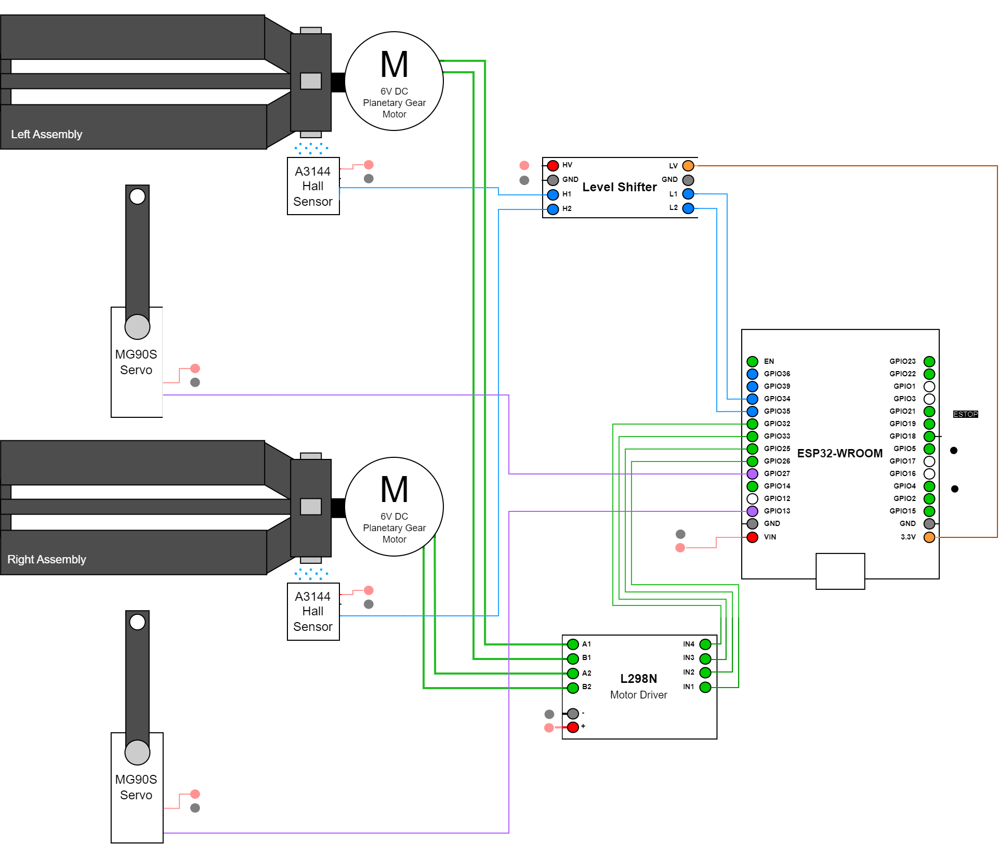

# SilkSpinner

[](https://opensource.org/licenses/MIT)

An ESP32 powered lab machine for automatic silk cocoons winding. This repository contains the electronics schematic, firmware and 3D printed parts required for full assembly.

The system was designed for the purpose of winding single silkworm cocoons onto sample bobbins for fibre analysis. The current iteration can monitor, drive, and log data for two separate instances at the same time.

The project was developed in cooperation with the Faculty of Natural Sciences and Engineering, University of Ljubljana.

|  |   | 
| ----------- | ----------- |
|  |  |

## Functonality

The system implements the following functionality:

- guide wheels on bearings to line up and stretch the string

- servo actuators that guide the string onto specific positions of the bobbin, with constant sinusoidal movement that prevents the string from sticking to itself

- automatic sample taking by winding a set distance to a set section of the bobbin (e.g. five samples of 200m, each wound 1 cm apart)

- manual servo control

- smooth start and stop movements for servos and main motors to emulate gentle hand-winding

- adjustable throttle and direction for main motors, speed and angle for actuators

- saving measurement distances and metadata to a `.csv` file and downloading them to the client machine from the web app

- an emergency stop push button, which quickly stops all motors

https://github.com/MoffKalast/SilkSpinner/assets/9977799/55012754-9cc3-48a4-b408-5423bcaef4a0

## Firmware

The ESP firmware is split into two parts: the Arduino control backend and the browser web app that's served from SPIFFS via a WiFi hotspot, both linked together by WebSockets for telemetry and control. 

#### 1. Install Arduino IDE and the following plugins/libraries

- [ESP32](https://randomnerdtutorials.com/installing-the-esp32-board-in-arduino-ide-windows-instructions/)
- [SPIFFS](https://github.com/me-no-dev/arduino-esp32fs-plugin)
- [ESPAsyncWebServer](https://github.com/me-no-dev/ESPAsyncWebServer)
- [AsyncTCP](https://github.com/me-no-dev/AsyncTCP)
- [Arduino_JSON](https://github.com/arduino-libraries/Arduino_JSON)
- [ESP32Servo](https://github.com/madhephaestus/ESP32Servo)

Open `firmware.ino`

#### 2. Write the web app to flash

Running the [ESP32 Sketch Data Upload](https://randomnerdtutorials.com/install-esp32-filesystem-uploader-arduino-ide/) should upload everything in the /data directory that's not part of the main sketch.

#### 3. Build and upload the sketch

As normal, upload the sketch and reset the ESP32. The Wifi hotspot should show up automatically with the default SSID `SilkSpinner` and password `sviloprejka`. The web app can be accessed in a browser at `http://192.168.4.1`


## Electronics

The system runs in an ESP32-WROOM, specifically a devkit V1 wired to the following components as shown on the circuit diagram below:



As the bobbin on each side rotates, the magnets mounted on the central hub pass past the hall sensor and act as an encoder with 3 ticks per rotations, which is used to track the total distance. The level shifters convert the 5V hall sensor signals to safe 3.3V levels.

The following BoM of electronic components was used for the second prototype, most parts are interchangable with general equivallents:

| Quantity | Description                    |  Notes                    |
|----------|--------------------------------|------------------------------------|
| 1        | ESP32-WROOM DevkitV1           | Main MCU                           |
| 1        | L298N Mini                     | Motor driver board                 |
| 1        | BSS138 level shifter           | 3.3 V to 5 V level shifter         |
| 2        | JGA25-370 Geared motor         | Winding motors, 6V, 300 RPM version|
| 2        | A3144 Hall sensor              | Digital hall sensor                |
| 2        | MG90S                          | Director vane micro servo          |
| 1        | 12mm Momentary pushbutton      | ESTOP switch                       |
| a few meters   | Solid strand wire        |                  |

## Mechanical Assembly

The current design uses the following BoM of aluminium extrusions and mounting pieces.

| Quantity | Description                    | Length (mm) | Notes                    |
|----------|--------------------------------|-------------|--------------------------|
| 2        | 30x30 U8 Aluminium Extrusion   | 900         | Cross bars               |
| 2        | 30x30 U8 Aluminium Extrusion   | 1000        | Vertical bars            |
| 2        | 30x30 U8 Aluminium Extrusion   | 600         | Stand                    |
| 8        | 30x30 Right Angle Bracket      | -           | |
| 12       | U8 M4 Mounting Stone           | -           | |
| 12       | M4 L40 Cylindrical Bolt        | -           | |
| 16       | M6 M12 Conical Head Bolt       | -           | |
| 16       | U8 M6 Hammerhead Bolt          | -           | |


The mounting heights for the guide wheel crossbar and servo crossbar are adjustable per-experiment.

The files for the custom 3D printed parts are included in `/3dprint`. Consult the [3D printing readme](3dprint/README.md) for more info.

Other required parts:

| Quantity | Description                    |  Notes                    |
|----------|--------------------------------|------------------------------------|
| 4        | Ball bearing                   | Outer diameter 28mm, inner diameter 12mm               |
| 4        | M3 screws                   | For the electronics box                                  |
| 6        | Neodynium magnet           | 5mm diameter, 3mm height, as the bobbin encoder   |

## Cite

If you're using the Silk Spinner for your research, please cite:

```bibtex
@article{TBD}
``` 

-------------

